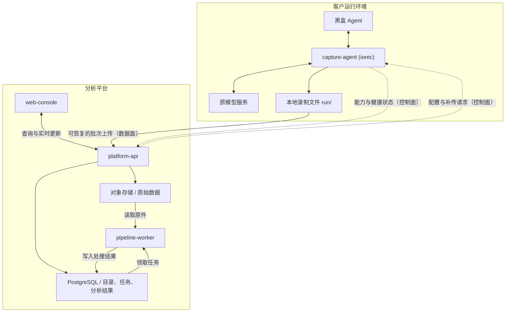
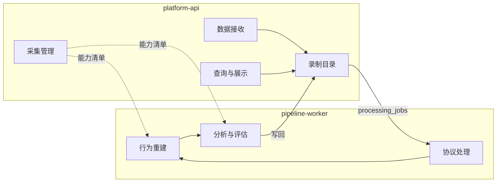

# 01 · 总体架构

## 1. 架构图

模型推理仍发生在客户环境与原模型服务之间。平台不需要在线才能运行 Agent；网络中断时，采集端继续按本地策略记录。

图中的代理是主要采集方式。Agent 原生 Hook（Hermes observer plugin、Gemini `BeforeModel/AfterModel`、Claude Code lifecycle hooks）、session 文件、OTel 和运行时插桩是其他输入，全部共用同一个本地 Event Writer，因此平台只看到一种事件协议。

## 2. 设计原则

1. **采集端独立可用。** 没有平台也能完成录制、`iorec inspect` 和导出；平台是增量能力。
2. **原件不可变。** 对象存储中的批次和 blob 一旦写入不再修改；所有解析、关联、分析都是带版本的派生结果，可以重跑。
3. **ACK 只承诺"原始数据已可靠保存"。** 不承诺已解析、已关联或已分析。
4. **未知保持未知。** 无法归属的请求照常进入列表，关系为空；推断的关系标为 `inferred` 并带置信度；不自动生成看似确定的调用树。
5. **完整性由平台重算。** 采集端上传的 coverage manifest 是输入之一，平台结合 drop 计数、unknown egress、缺失终态等重新给出 claim。
6. **能力决定分析。** 采集端上报能力清单，平台据此决定哪些分析可以执行、哪些结论只能标 `unknown`。
7. **租户来自认证。** 不信任上传事件自己声明的租户、项目字段。

## 3. 四个部署单元

| 部署单元 | 运行位置 | 核心职责 | 首版形态 |
|---|---|---|---|
| `capture-agent` | 客户主机 / 容器附近 | 启动或接入 Agent、采集、落盘、上传、能力上报 | 独立 CLI / daemon，即 `iorec` |
| `platform-api` | 平台服务端 | 接收数据、管理采集端、查询、实时通知、访问控制 | 一个模块化服务 |
| `pipeline-worker` | 平台服务端 | 解析协议、重组请求、关联会话、运行分析、导出 | 独立 Worker，可多副本 |
| `web-console` | 平台前端 | 录制管理、请求检查、时间线、分析与采集状态 | Web 应用 |

首版不把每个业务模块拆成微服务。API 与 Worker 独立部署，已经能隔离交互请求和耗时处理。

### 语言选择

后端统一一种语言。若无团队技术栈约束，建议 Go 开发采集端、API 和 Worker，TypeScript 开发前端。理由：

- 采集端需要单一静态二进制、低开销的流式代理和 pcap/eBPF 工具的子进程集成，eCapture 本身是 Go 项目。
- API 与 Worker 共享事件协议、解码器和数据模型代码，同一语言可以避免两份实现漂移。
- 后续需要模型评估或数据科学库时，再增加 Python 分析执行器，通过任务表接入，不改主干。

## 4. 采集端内部组件

| 组件 | 职责 | 必须保存的信息 | 对应路线图 |
|---|---|---|---|
| Launcher / 运行接入 | 启动进程、识别进程树、接入已有容器 | 运行 ID、版本、进程实例、启动配置 | RUN-001～005 |
| Model Capture | 采集 HTTP、SSE、WS 请求与响应 | 正文字节、方向、时间、错误、取消 | NET-* |
| Interaction Capture | 采集可访问的 PTY / 标准输入输出 | 用户交互与 Agent 展示内容 | 新增，见下 |
| Runtime Observers | 可选的进程、文件、网络观察 | 来源、观察范围、实际权限与能力 | BPF-*、TLS-* |
| Agent Adapters | 原生 Hook、session 文件解析 | lifecycle 事件、原生 ID | ADP-* |
| Event Writer | 分配序号、追加写入、记录缺口、恢复 | 事件序号、持久化边界、完整性状态 | EVT-* |
| Uploader | 批次上传、断点续传、重试 | 批次 hash、服务端确认位置 | UP-001～005 |
| Control Client | 上报能力与健康、接收配置 | 配置版本、实际生效值、拒绝原因 | 新增，见 09 |

这些是采集进程内部组件。需要额外系统权限的观察器单独运行为特权 helper，通过本地 IPC 接入，Agent 进程本身不提权（与路线图 SEC-004 一致）。

Interaction Capture 是采集端路线图未单列的项：它只提供 L0 层证据，用于校验用户实际看到的输出，不能替代模型 I/O 录制。PTY 录制默认关闭，开启后按内容策略脱敏。

**"装上采集端"不代表所有能力都可用。** 采集端应上报类似"HTTP 正文可见、WS 未覆盖、PTY 已启用、进程观察不可用、TLS surface 含未知项"的能力清单，平台据此决定哪些分析可以执行。能力清单的结构见 [09-collector-control.md](09-collector-control.md)。

## 5. 平台的七个业务模块

| 模块 | 负责什么 | 输出 / 拥有的数据 | 首版归属 |
|---|---|---|---|
| 采集管理 | 注册、心跳、能力、配置、补传请求 | Collectors、配置版本、控制请求 | API |
| 数据接收 | 原生事件批次、文件导入、可选 OTLP 接入；校验、去重、归档 | 原始批次与接收凭据 | API |
| 录制目录 | 录制范围、文件清单、上传进度、缺口、结束状态 | Recordings、Batches、Coverage | API |
| 协议处理 | 解码、流重组、识别模型请求与响应 | Attempts、内容块、usage、错误 | Worker |
| 行为重建 | 关联请求、进程、工具、原生 session 与分支 | Sessions、Relations、上下文版本 | Worker |
| 分析与评估 | 确定性规则、可选模型评审、验收、数据集与导出 | Findings、Evaluations、Datasets | Worker |
| 查询与展示 | 时间线、原始请求、diff、统计、实时更新 | 面向页面的查询结果 | API + Web |

最值得单独维护的是**行为重建模块**。它不能假定收到的都是完整 trace，必须处理缺少父事件、没有 session ID、事件晚到和多个候选关系。详见 [06-behavior-reconstruction.md](06-behavior-reconstruction.md)。

## 6. 两条协议

| 协议 | 方向 | 内容 | 传输 |
|---|---|---|---|
| 统一事件协议（数据面） | 采集端 → 平台 | 事件批次、blob、manifest | HTTPS，固定批次，幂等，可断点续传 |
| 采集管理协议（控制面） | 双向 | 注册、能力、健康、版本化配置、补传/暂停/刷写请求 | HTTPS 长轮询，首版不要求持久连接 |

两条协议都以采集端为发起方，平台不需要能主动连到客户环境。

## 7. 模块边界示意

