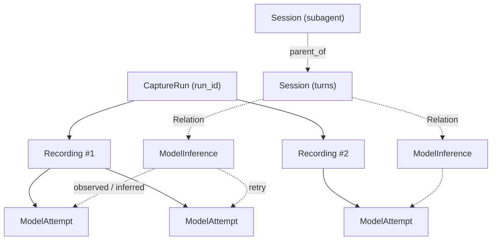

# 02 · 核心数据模型与存储分工

## 1. 核心对象

| 对象 | 含义 | 来源 |
|---|---|---|
| `Tenant` / `Project` | 隔离边界；所有资源都挂在 project 下 | 认证 |
| `Collector` | 一个采集端实例及其能力 | 控制面注册 |
| `CaptureRun` | 一次受控的运行或观察范围，对应采集端 `run_id` | 事件 |
| `Recording` | 一组可归档、上传和导出的事件记录；序号空间的单位 | 事件 |
| `Batch` | 一次上传的固定批次，含序号范围与 hash | 数据面 |
| `Blob` | 内容寻址的正文 / 附件，按 project 去重 | 数据面 |
| `ModelAttempt` | 一次实际观察到的模型请求尝试 | 协议处理 |
| `ModelInference` | 逻辑上的一次模型调用；由 Hook 观察到，或由多个 attempt 推断 | 协议处理 / 行为重建 |
| `Session` | 原生或推断的业务会话，含 `turns` | 行为重建 |
| `Relation` | 对象之间的关系、证据和判断版本 | 行为重建 |
| `Finding` | 一条分析发现及其证据 | 分析 |
| `ProcessingJob` | 可恢复、可重试的数据处理任务 | 接收 / 重跑 |
| `CollectorRequest` | 平台向采集端下发的补传、配置等请求及其结果 | 控制面 |

`CaptureRun`、`Recording`、`Session` 不互相代替：一个运行实例可以滚动生成多个 Recording，也可能承载多个业务会话（`hermes gateway` 一个进程服务多个 Telegram 会话）；反过来一个业务会话也可能跨多个 CaptureRun（用户重启 Agent 继续同一 Codex thread）。

### 与采集端 ID 层级的映射

采集端：`run → session → turn → inference → attempt → stream event`。



实线是事实（哪个 Recording 里观察到了哪个 attempt），虚线全部是 `Relation`，带状态、置信度和证据。

## 2. 派生结果的最小携带字段

每个派生对象（attempt、inference、session、relation、finding）至少携带：

```json
{
  "recording_id": "rec-123",
  "entity_id": "attempt-17",
  "evidence_refs": [
    {"recording_id": "rec-123", "first_seq": 120, "last_seq": 158}
  ],
  "processor_version": "decoder-v3",
  "relation_status": "observed"
}
```

- `evidence_refs`：指回原始事件序号区间，可以跨 Recording。任何页面上的结论都能点回原件。
- `processor_version`：生成它的处理器版本。重跑后旧版本结果保留到新版本发布再清理。
- `relation_status`：`observed`（有显式 ID 或 Hook 证据）、`inferred`（规则推断）、`unknown`（未归属，关系字段为空）、`conflict`（多个候选无法裁决）。

## 3. PostgreSQL 表结构草案

仅列关键列。所有业务表都带 `project_id` 并作为索引前缀；时间列统一 `timestamptz`。

```sql
-- 目录与接收
create table collectors (
  id uuid primary key, project_id uuid not null,
  name text, version text, hostname text,
  capabilities jsonb not null,           -- 见 09
  effective_config jsonb, config_version bigint,
  last_heartbeat_at timestamptz, status text   -- online|stale|offline|revoked
);

create table capture_runs (
  id text primary key,                    -- 采集端 run_id，全局唯一
  project_id uuid not null, collector_id uuid,
  command text, cwd text, agent_kind text, agent_version text,
  started_at timestamptz, ended_at timestamptz, exit_code int,
  metadata jsonb,                         -- 环境变量白名单、二进制哈希等
  transport_proof jsonb,                 -- 平台自有 task-egress 解码/正文对账 proof
  transport_proof_revision bigint not null default 0
);

create table recordings (
  id text primary key, project_id uuid not null, capture_run_id text not null,
  segment_no int not null, schema_version int not null,
  state text not null,                    -- open|sealed|archived|deleting|deleted
  durable_seq bigint not null default 0,  -- 原始数据已保存到哪里
  parsed_seq bigint not null default 0,   -- 已解析到哪里
  relation_revision bigint not null default 0,
  analysis_revision bigint not null default 0,
  coverage jsonb,                         -- 平台重算的 coverage，见 07
  sealed_at timestamptz, retention_until timestamptz,
  unique (capture_run_id, segment_no)
);

create table batches (
  recording_id text not null, batch_id text not null,
  first_seq bigint not null, last_seq bigint not null,
  event_count int not null, byte_length bigint not null,
  sha256 bytea not null, object_key text not null,
  received_at timestamptz not null,
  primary key (recording_id, batch_id),
  unique (recording_id, first_seq)
);

create table blobs (
  project_id uuid not null, sha256 bytea not null,
  size bigint not null, media_type text, object_key text not null,
  first_seen_at timestamptz not null, ref_count int not null default 0,
  primary key (project_id, sha256)
);

-- 派生事实
create table model_attempts (
  id text primary key, recording_id text not null, project_id uuid not null,
  inference_id text,                      -- 可空：未归属
  connection_id text, source text not null,          -- proxy|ebpf|keylog|hook|sdk
  protocol text, provider_host text, api_mode text,  -- chat_completions|responses|anthropic_messages|gemini|ws
  model text, started_at timestamptz, ended_at timestamptz,
  terminal_state text,                    -- completed|error|cancelled|truncated|unknown
  status_code int, error_class text,
  request_body_ref bytea, response_body_ref bytea,   -- blob sha256
  usage jsonb, headers_allowlist jsonb,
  evidence_refs jsonb not null, processor_version text not null,
  pid int, container_id text
);

create table model_inferences (
  id text primary key, recording_id text not null, project_id uuid not null,
  status text not null,                   -- observed|inferred
  attempt_count int not null, first_attempt_at timestamptz,
  request_fingerprint bytea,              -- system prompt + tools 指纹，见 06
  input_hash bytea, resolved_input_ref bytea,        -- 展开服务端状态后的输入，可空
  server_state text,                      -- none|resolved|unresolved
  evidence_refs jsonb not null, processor_version text not null
);

create table sessions (
  id text primary key, project_id uuid not null,
  kind text not null,                     -- native|inferred
  native_id text, agent_kind text,
  parent_session_id text, role text,      -- main|subagent|summary|router
  turns jsonb,                            -- [{turn_id, started_at, ended_at, inference_ids}]
  first_seen_at timestamptz, last_seen_at timestamptz,
  relation_revision bigint not null
);

create table relations (
  id bigserial primary key, project_id uuid not null,
  type text not null,                     -- attempt_of|belongs_to_turn|parent_of|tool_call_of|process_of
  from_id text not null, to_id text not null,
  status text not null,                   -- observed|inferred|conflict
  confidence real, evidence jsonb not null,          -- [{kind, refs, weight}]
  revision bigint not null, superseded_by bigint,
  created_at timestamptz not null
);
create index on relations (project_id, from_id, revision);
create index on relations (project_id, to_id, revision);

create table findings (
  id uuid primary key, project_id uuid not null, recording_id text,
  rule_id text not null, severity text not null,     -- info|warn|high
  title text, detail jsonb, evidence_refs jsonb not null,
  status text not null,                   -- open|confirmed|dismissed
  analysis_revision bigint not null, created_at timestamptz,
  reviewed_by text, reviewed_at timestamptz, review_note text
);

-- 处理与控制
create table processing_jobs (
  id uuid primary key, project_id uuid not null,
  type text not null,                     -- decode|assemble|normalize|resolve|transport_audit|rules|eval|coverage|export
  recording_id text, input_ref jsonb not null,       -- {first_seq,last_seq} 或 {revision}
  processor_version text not null,
  dedupe_key text not null unique,        -- type + input_ref + processor_version
  status text not null,                   -- pending|leased|done|failed|dead
  lease_owner text, lease_until timestamptz,
  attempts int not null default 0, last_error text,
  priority int not null default 0, created_at timestamptz, finished_at timestamptz
);
create index on processing_jobs (status, priority, created_at) where status in ('pending','leased');

create table assembly_state (
  recording_id text not null, stream_key text not null, -- connection_id 或 attempt_id
  state bytea not null, last_seq bigint not null, version bigint not null,
  primary key (recording_id, stream_key)
);

create table collector_requests (
  id uuid primary key, collector_id uuid not null, project_id uuid not null,
  type text not null,                     -- backfill|apply_config|pause|resume|flush|seal
  payload jsonb not null, status text not null,      -- pending|delivered|acked|done|rejected|expired
  result jsonb, created_at timestamptz, expires_at timestamptz, finished_at timestamptz
);

create table notifications_outbox (
  id bigserial primary key, project_id uuid not null,
  entity_type text not null, entity_id text not null,
  revision bigint, kind text not null, created_at timestamptz not null
);
```

要点：

- `recordings.durable_seq` 只在批次事务里推进，且只接受"连续"的推进（见 04）。
- `relations` 是 append-only，新的关联结果生成新 `revision`，旧行标 `superseded_by`；页面默认读最新 revision，审计可以回看。
- `model_attempts.inference_id` 允许为空，这是"未归属请求照常进入列表"的落点。
- `processing_jobs.dedupe_key` 唯一约束就是 Worker 的幂等边界。

## 4. 存储分工

| 存储 | 保存内容 | 原则 |
|---|---|---|
| 本地文件（采集端） | 原始事件、附件、恢复记录、上传状态 | 支持独立使用与离线上传；是原件的第一副本 |
| 对象存储 | 原始事件批次、大正文、附件、导出文件 | 保留可重新解析的原件；只追加、不改写 |
| PostgreSQL | 录制目录、批次索引、请求元信息、关系、发现、任务 | 首版业务事实与查询主库；同时充当任务队列 |
| ClickHouse（后续可选） | 大规模调用明细、usage、延迟与聚合投影 | 分析负载拖慢事务库时引入，只做投影不做事实源 |

大正文通过 `body_ref`（blob sha256）指向对象存储，避免每个分析表复制一份完整 prompt。第一版用 PostgreSQL 任务表驱动 Worker，不增加独立消息系统。

这种"对象归档 + 异步处理 + 事务库 / 分析库分工"有成熟实现可参考，Langfuse 采用了相似的基础设施分工。[Langfuse 架构](https://langfuse.com/handbook/product-engineering/architecture)

## 5. 对象存储 key 布局

```text
{tenant}/{project}/recordings/{recording_id}/batches/{first_seq:012d}-{last_seq:012d}.ndjson.zst
{tenant}/{project}/recordings/{recording_id}/manifest/{uploaded_at}.json
{tenant}/{project}/blobs/sha256/{ab}/{cd}/{sha256}
{tenant}/{project}/exports/{export_id}/{filename}
{tenant}/{project}/derived/{recording_id}/{processor_version}/...   # 可重建，可随时清理
```

- 批次 key 由序号区间决定，重传同一批次得到同一 key，天然幂等。
- blob 按 project 去重；跨 project 不去重，避免通过 hash 探测其他租户是否持有同一内容。
- `derived/` 下是可再生的中间产物（例如重组后的完整 SSE 流），丢失只需重跑。

## 6. 不进入平台的数据

以下内容默认只留在采集端本地，不通过数据面上传，除非项目配置显式开启并经过审计：

- `capture.pcapng` 与 `tls.keys.enc`：解密后含 `Authorization` 与全部正文，属最高敏感级。
- PTY 原始录制中的用户输入。
- 环境变量白名单之外的任何环境值。

平台在 `Recording.coverage.capture_sources` 中记录这些来源"本地存在但未上传"，页面据此提示可以用 `iorec export` 本地取证。
