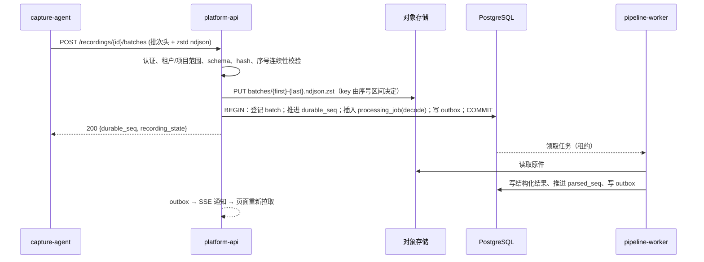

# 04 · 接收链路与提交边界

## 1. 一次上传的处理顺序



1. 采集端把事件封成固定批次，携带录制 ID、序号范围、长度和 hash。
2. API 校验身份、范围及内容，将原始批次保存到对象存储。
3. 在 PostgreSQL 同一个事务中，登记批次、更新接收状态并创建处理任务。
4. 事务提交后，向采集端返回已经可靠保存的连续序号。
5. Worker 领取任务，读取原件，生成结构化结果和分析结果。
6. 查询模块发布状态变化，页面重新获取对应数据。

**ACK 的含义是"原始数据已经可靠保存"，不要求解析或分析已经完成。**

## 2. 校验清单

按顺序执行，任一失败即拒收并返回结构化错误（见 08），不落对象存储：

| 校验 | 失败码 |
|---|---|
| 认证与 collector 归属；Recording 属于该 collector 的 project | 401 / 403 |
| Recording 状态为 `open`（`sealed` 后只接受 manifest 与补传窗口内批次） | 409 `recording_sealed` |
| `schema_version` 受支持 | 415 `unsupported_schema` |
| 批次头字段完整；`first_seq <= last_seq`；`event_count` 与实际行数一致 | 400 `malformed_batch` |
| sha256 与请求体一致 | 400 `hash_mismatch` |
| 事件 `seq` 在区间内连续、`recording_id` 一致 | 400 `seq_discontinuity` |
| 单批次、单事件大小限制 | 413 |
| 项目配额（存储、速率） | 429 + `Retry-After` |

## 3. 幂等与冲突

- 相同 `batch_id`、相同 `sha256`：直接返回当前 `durable_seq`，不重复写对象、不重复建任务。
- 相同 `batch_id`、不同 `sha256`：返回 409 `batch_conflict`，并记录到 Recording 的 `integrity_alerts`。采集端不得覆盖，只能人工介入；这通常意味着本地文件被改写或两个采集端写了同一个 Recording。
- 序号区间与已登记批次重叠但边界不同：409 `batch_overlap`。采集端的批次边界一旦封定不能变，重启后必须按本地记录的边界重发。

## 4. `durable_seq` 的推进规则

`durable_seq` 表示"从 1 到该序号的原始事件全部已可靠保存"。只在批次事务中推进，且只允许连续推进：

- 收到 `[120,158]` 而 `durable_seq = 119`：推进到 158。
- 收到 `[160,200]` 而 `durable_seq = 119`：登记批次，`durable_seq` 不动，ACK 返回 119；采集端据此知道 `[120,159]` 仍待发。
- `[120,159]` 稍后到达：推进到 200（跳过已登记的后续批次）。

采集端在同一 Recording 内串行上传，所以乱序只发生在重传场景，这个规则足够简单。

## 5. 对象存储与 PostgreSQL 之间没有共同事务

两种失败都要处理：

| 情形 | 处理 |
|---|---|
| 对象已保存、目录登记失败 | 采集端重试同一批次；key 由序号区间决定，PUT 复用同一对象。无引用的对象由每日 GC 扫描 `batches` 表清理，只清理创建超过 24 小时且无登记的对象 |
| 数据已登记、Worker 未执行 | 持久任务仍在 `processing_jobs`，Worker 恢复后按租约继续 |
| 事务提交、ACK 未送达 | 采集端重试，命中幂等短路 |

## 6. 四个进度指针

平台对每个 Recording 分别维护：

| 指针 | 含义 | 由谁推进 |
|---|---|---|
| `durable_seq` | 原始数据已保存到哪里 | API 批次事务 |
| `parsed_seq` | 数据已解析（decode + assemble + normalize）到哪里 | Worker |
| `relation_revision` | 当前关联结果版本 | Worker `resolve` |
| `analysis_revision` | 当前分析结果版本 | Worker `rules` / `eval` |

页面据此区分状态，不把后台处理失败显示成录制失败：

| 页面状态 | 判定 |
|---|---|
| 上传中 | Recording `open`，`durable_seq` 仍在推进 |
| 已归档 | Recording `sealed` 且 `durable_seq` 到达 manifest 声明的末序号 |
| 解析受阻 | `parsed_seq < durable_seq` 且存在 `failed`/`dead` 的 decode 任务 |
| 正在分析 | `parsed_seq == durable_seq` 且 `analysis_revision` 落后于 `relation_revision` |
| 原始数据不完整 | 有 `gap` 事件，或 manifest 末序号大于 `durable_seq` 且采集端已离线 |

## 7. Recording 生命周期

```text
open ──seal──> sealed ──retention──> archived ──delete──> deleting ──> deleted
  │                │
  └─ collector 离线超时且无 manifest ──> sealed(incomplete)
```

- `seal` 由采集端在 run 结束或滚动切段时发起，携带最终序号与 manifest。
- 采集端离线超过项目配置的窗口（默认 24 小时）仍未 seal，平台自动 seal 并标 `incomplete`；之后采集端上线仍可补传，补传窗口内批次照常接收并触发重算。
- `deleting` 阶段先删对象再删目录行。删对象后崩溃只会留下"有目录、无原件"的行，重试可继续；反过来先删行会留下无人引用的对象，只能靠 GC 兜底。

## 8. 背压与配额

- 每 project 配置存储上限与每分钟批次/字节速率。超限返回 429 与 `Retry-After`，采集端退避并继续本地积压（UP-005）。
- 平台变慢时不阻塞 Agent：采集端 Uploader 与 Event Writer 解耦，磁盘满或队列超限的策略由采集端配置决定（丢弃最旧 blob、停止 PTY、只保留元数据），并写 `gap` 事件上报。OTel Collector 的可靠传输设计对这些边界有同样的强调。[Collector Resiliency](https://opentelemetry.io/docs/collector/resiliency/)

## 9. 文件导入

没有网络或不愿装 Uploader 的客户可以直接上传整个 `run/` 目录（tar）：

```text
POST /recordings:import   (multipart: run.tar + 元数据)
```

导入服务在服务端把 `events.jsonl` 切成与在线上传完全相同的批次格式再走同一条登记链路，所以下游没有第二条路径。导入产生的 Recording 标 `origin: import`，`Collector` 为空。
