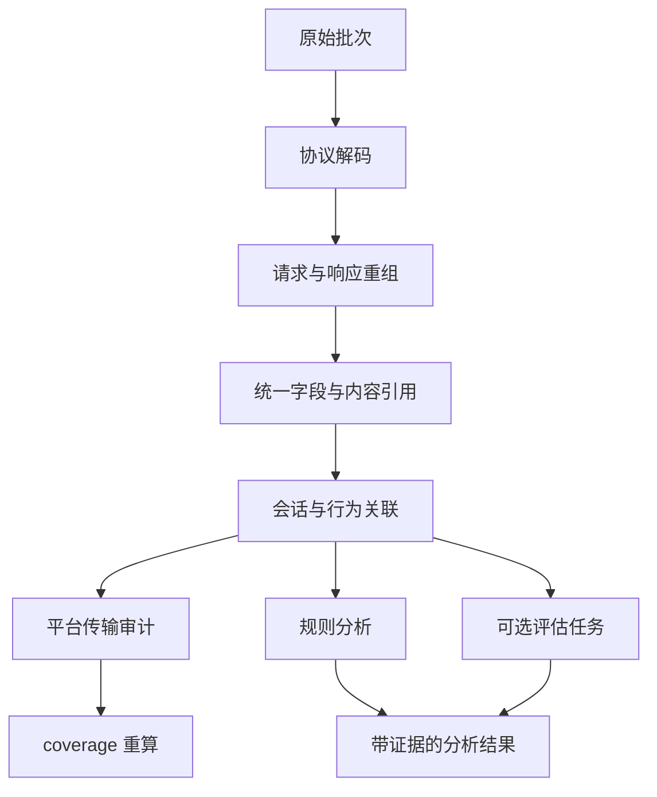

# 05 · Worker 处理流水线

## 1. 阶段

| 阶段 | 输入 | 输出 | 并行键 | 触发 |
|---|---|---|---|---|
| `decode` | 一个批次的原始事件 | 按 `source`/`event` 解出的结构（HTTP 帧、SSE 事件、WS frame、Hook 结构体） | 批次 | 批次登记 |
| `assemble` | decode 结果 + `assembly_state` | 完整的 `ModelAttempt`（请求 + 全部响应块 + 终态），`ModelInference`（Hook 观察到时） | `connection_id` / `attempt_id` | decode 完成 |
| `normalize` | 已重组的 attempt | 统一字段：provider、api_mode、model、messages/input 的规范化视图、usage、tool 调用；正文写 `body_ref` | attempt | assemble 完成 |
| `resolve` | 一个 Recording（或 CaptureRun）内全部 normalized 对象 + lifecycle 事件 + 能力清单 | `Session`、`Relation` 新 revision | CaptureRun | `parsed_seq` 推进、晚到证据、规则版本变化 |
| `transport_audit` | 整个 CaptureRun 的 task-egress pcap、TLS key log、runner 终态与 proxy body blob | 平台生成的版本化 hashes-only transport proof | CaptureRun | resolve 完成；敏感证据缺失时写 `unavailable` 而非报 complete |
| `coverage` | resolve 结果 + transport proof + 原始连接分类 + `gap`/`drop_counter`/`unknown_egress`/`tls_surface`/manifest | `Recording.coverage`（含 observed egress classes 与 model-bypass gate） | Recording | seal 或 transport_audit 完成 |
| `rules` | resolve 结果 | `Finding` | CaptureRun | `relation_revision` 推进 |
| `eval` | 指定 attempt/session 与评审模板 | `Finding`（kind = evaluation） | attempt | 手动或规则触发 |
| `export` | 查询范围 | 对象存储中的导出文件 | 导出请求 | 手动 |

同一组 Worker 执行全部类型，但任务类型和版本独立；`eval` 走独立并发池或独立 Worker 副本，避免堵住基础解析。

## 2. 任务模型

`processing_jobs` 表就是队列（见 02）。

- **去重**：`dedupe_key = type + input_ref + processor_version`，唯一约束保证同一输入同一版本只处理一次。
- **领取**：`UPDATE … SET status='leased', lease_owner=$w, lease_until=now()+interval '5 min' WHERE id = (SELECT id FROM processing_jobs WHERE status='pending' ORDER BY priority DESC, created_at FOR UPDATE SKIP LOCKED LIMIT 1) RETURNING *`。
- **续约**：长任务每分钟续租；崩溃的 Worker 租约过期后任务回到 `pending`，`attempts + 1`。
- **重试**：指数退避，最多 5 次；之后转 `dead`，进入页面的"解析受阻"列表，可人工重跑。
- **毒任务隔离**：`dead` 任务不阻塞同 Recording 的后续批次；`parsed_seq` 停在该批次之前，后续批次的结果标 `provisional` 直到前置任务修复。
- **优先级**：进行中（`open`）Recording 的 decode 高于封存重跑；用户主动触发的重跑最高。

## 3. 流式重组的检查点

流式请求会跨多个上传批次，一个 SSE 响应可能分散在几十个批次里。重组状态不能依赖某个 Worker 的内存：

- `assembly_state` 以 `(recording_id, stream_key)` 为主键保存半成品：已见 header、已拼接的 chunk 序列摘要、最后处理的 `seq`、`version`。
- `assemble` 任务处理一个批次时，读取其中出现的每个 `stream_key` 的状态，追加，写回时用 `version` 做乐观并发；冲突则重试。
- 不同 `stream_key` 完全并行；同一 `stream_key` 由版本检查串行化。
- 收到 `attempt_end` / `attempt_error` / `attempt_cancel` / `connection_close` 后，把半成品固化为 `ModelAttempt`，`terminal_state` 分别为 `completed` / `error` / `cancelled` / `truncated`。
- Recording 封存后仍有未终止的 stream：固化为 `terminal_state = unknown`，coverage 中 `all_attempts_have_terminal_state = false`。

HTTP/2 的独立 wire stream 重组只来自 pcap + key log / eBPF，`stream_key` 为 `connection_id + h2_stream_id`。透明 TLS proxy 可以通过 ALPN 接收 HTTP/2，但 proxy 事件本身不提供可独立验证的 wire stream ID，不能替代解码证据。

## 4. 版本化与重跑

- 每个处理器有独立版本号（`decoder-v3`、`resolver-v7`、`rules-v12`）。派生结果携带 `processor_version`。
- **解析器升级**：为受影响 Recording 生成新的 `decode`/`assemble`/`normalize` 任务，读原件重算；新结果写入后原子切换 `parsed_seq` 对应版本，旧版本结果延迟清理。
- **关联规则升级**：只重跑 `resolve` 及下游，不重新解码字节。
- **规则升级**：只重跑 `rules`。
- 重跑范围可以是 project、时间窗或单个 Recording；批量重跑以低优先级排队。

## 5. 各阶段的具体职责

### decode

- HTTP/1.1 帧解析、chunked 解码、gzip/br 解压（保留压缩前原始字节引用）。
- SSE：按 `\n\n` 分事件，保留 `event:`/`data:`/`id:` 原文与到达时间。
- WebSocket：frame 方向、opcode、分片重组、close code。
- Hook 结构体：Hermes `pre_api_request` 等直接就是结构化 JSON，只做 schema 校验。
- 解不出的连接产出 `unparsed_connection` 记录，进入 coverage。

### assemble

- 把请求 header/body、响应 header、全部 chunk、终态拼成一个 attempt。
- 识别 api_mode：`chat_completions`、`responses`、`anthropic_messages`、`gemini_generate`、`codex_responses_ws`、`unknown`。
- 从响应中抽 usage、finish_reason、`response.id`、`previous_response_id`（服务端状态链输入）。

### normalize

- 生成 provider 无关的 `messages` 视图（role、content parts、tool_calls、tool_results），原始正文仍以 `body_ref` 保留。
- 计算 `request_fingerprint`（system prompt 规范化 hash + tools 名称集合 hash）和 `input_hash`（完整规范化输入 hash），供 resolve 使用。
- 提取 `cache_control`、`cached_content`、`store`、`previous_response_id` 等服务端状态字段。

### resolve

见 [06-behavior-reconstruction.md](06-behavior-reconstruction.md)。

### transport_audit

- 逐 blob 校验平台目录长度、SHA-256、事件来源、pcap chunk 序号/偏移和 NSS key-log 语法，再写入 mode `0600` 的私有临时文件。
- 只接受唯一、完整的 task-network 配置、目标约束、目标窗口关闭、网络 helper 终态和 pcap 终态；缺字段、重复事件、非整数零计数或透明模式证据缺失均 fail closed。
- 使用 Worker 镜像内固定绝对路径的 TShark 4.4+，清空继承环境并限制时间、行、输出、stream、body 和 artifact 大小；重组 H1/H2（含 multiplex/padding/END_STREAM）。
- 从原始 proxy 事件和 body blob 独立计算 request/response 长度与 SHA-256，以 method/path/status/body signature 做精确多集合比对。任一未归属、重复终态、歧义、missing/extra 或 decoder diagnostic 都进入 gap。
- proof 保存在 `capture_runs.transport_proof`，每次写入递增 revision 并为所有 Recording 重新排队当前版本 coverage。

### coverage

见 [07-analysis-and-findings.md](07-analysis-and-findings.md) §5。

## 6. 可观测性

Worker 自身暴露：每类任务的积压量、P95 处理时长、失败率、`dead` 数量、每 Recording 的 `durable_seq - parsed_seq` 差值。差值持续增长是首版最重要的扩容信号（见 11）。
